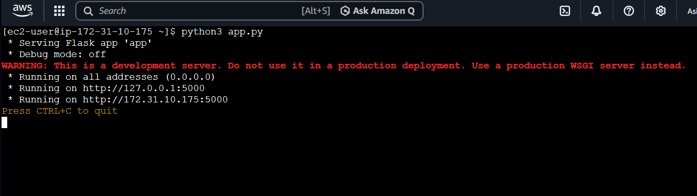
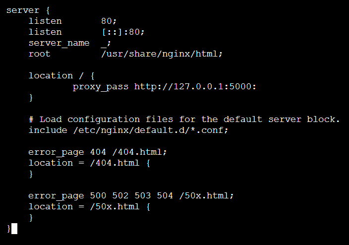
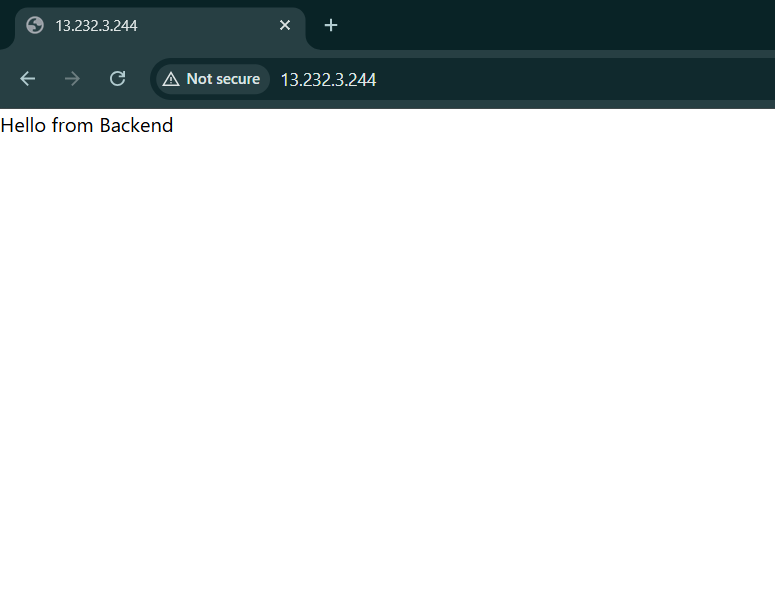
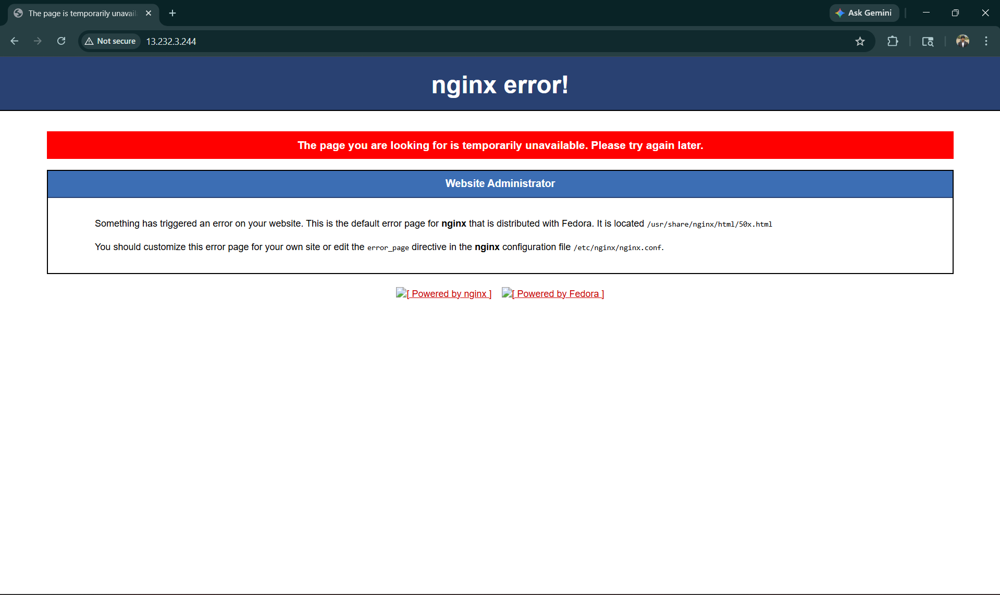
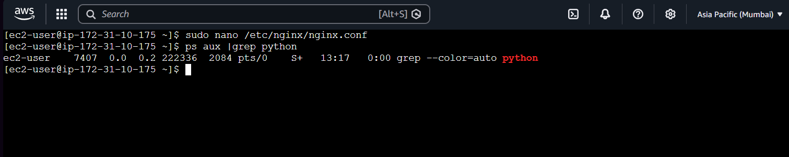
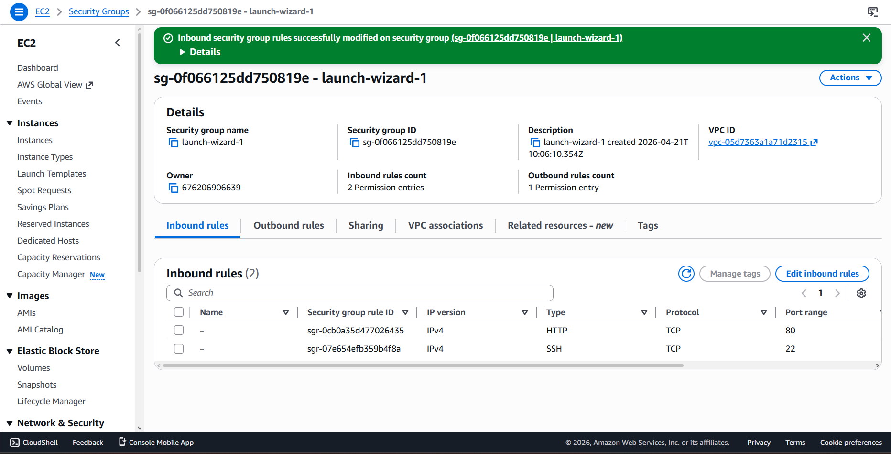

Good—this is the final polish that makes your project look **professional, not just completed**.

Here’s your **updated README (clean, structured, no unnecessary duplication, with screenshots properly embedded):**

---

````markdown
# NGINX Reverse Proxy + 502 Bad Gateway Debugging

## 📌 Project Overview
This project demonstrates how NGINX acts as a reverse proxy for a Flask backend hosted on an AWS EC2 instance. It also simulates a real-world failure scenario where the backend goes down, resulting in a **502 Bad Gateway** error, and shows how to debug and resolve it.

---

## 🧠 Architecture
Client → NGINX (Port 80) → Flask Backend (Port 5000)

---

## ⚙️ Technologies Used
- AWS EC2
- NGINX
- Python (Flask)

---

## 🚀 Setup Steps

### 1. Launch EC2 Instance
- Create and start an EC2 instance
- Connect using SSH (EC2 Instance Connect)

### 2. Install Required Packages
```bash
sudo dnf install nginx -y
sudo dnf install python3 -y
pip3 install flask
````

### 3. Create Flask Backend (`app.py`)

```python
app.run(host="0.0.0.0", port=5000)
```

### 4. Start Backend

```bash
python3 app.py
```

---

## 🔧 Configure Reverse Proxy

Edit NGINX configuration and add:

```nginx
location / {
    proxy_pass http://127.0.0.1:5000;
}
```

👉 This forwards incoming requests from port 80 to the backend running on port 5000.

---

### 5. Allow HTTP Traffic

* Add inbound rule in Security Group:

  * Port 80 (HTTP)
  * Source: 0.0.0.0/0

---

### 6. Restart NGINX

```bash
sudo nginx -t
sudo systemctl restart nginx
```

---

## ✅ Working State

Open:

```
http://<public-ip>
```

Output:

```
Hello from Backend
```

---

## ❌ Failure Simulation (502 Bad Gateway)

### Step:

Stop backend:

```bash
CTRL + C
```

### Result:

* NGINX cannot reach backend
* Browser shows:

```
502 Bad Gateway
```

---

## 🔍 Root Cause Analysis

Check backend process:

```bash
ps aux | grep app.py
```

### Observation:

* No Flask process running
* Backend is down

---

## 🛠️ Fix

Restart backend:

```bash
python3 app.py
```

---

## 📸 Screenshots

### 1. Backend Running



### 2. NGINX Configuration



### 3. Working Output



### 4. 502 Error



### 5. Root Cause (Backend Down)



### 6. Security Group Check



---

## 🎯 Key Learnings

* Reverse proxy concept
* Difference between frontend and backend
* Importance of backend availability
* Understanding 502 Bad Gateway error
* Step-by-step debugging approach:

  * Network (Security Group)
  * Server (NGINX)
  * Application (Flask)

---

## 💡 Conclusion

This project simulates a real-world issue where a web server is running but the backend service is down. It demonstrates how to identify the problem, verify the root cause, and restore service efficiently.

---

## 🔗 Author

Built as part of hands-on cloud and DevOps learning journey.


